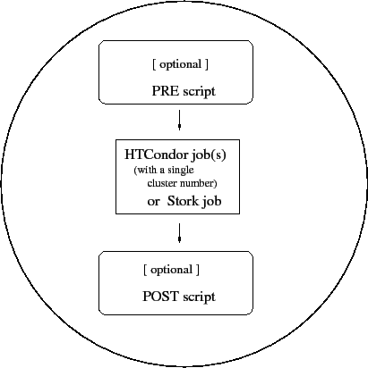

DAGMan Applications
===================

A directed acyclic graph (DAG) can be used to represent a set of computations where the input, output, or execution of one or more computations is dependent on one or more other computations. The computations are nodes (vertices) in the graph, and the edges (arcs) identify the dependencies. HTCondor finds machines for the execution of programs, but it does not schedule programs based on dependencies. The Directed Acyclic Graph Manager (DAGMan) is a meta-scheduler for the execution of programs (computations). DAGMan submits the programs to HTCondor in an order represented by a DAG and processes the results. A DAG input file describes the DAG, and further submit description file(s) are used by DAGMan when submitting programs to run under HTCondor.

DAGMan is itself executed as a scheduler universe job within HTCondor. As DAGMan submits programs, it monitors log file(s) to enforce the ordering required within the DAG. DAGMan is also responsible for scheduling, recovery, and reporting on the set of programs submitted to HTCondor.

DAGMan Terminology
------------------

To DAGMan, a node in a DAG may encompass more than a single program submitted to run under HTCondor.

